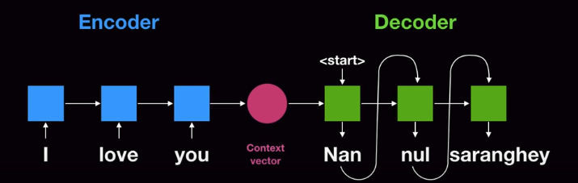
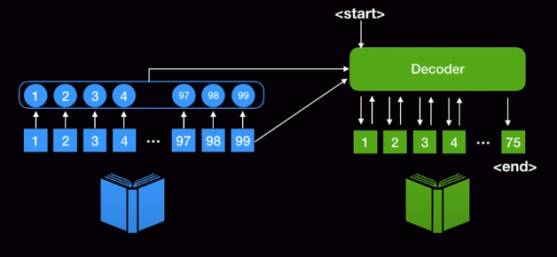
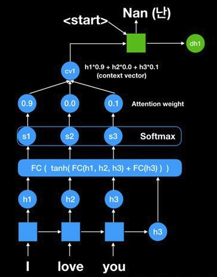
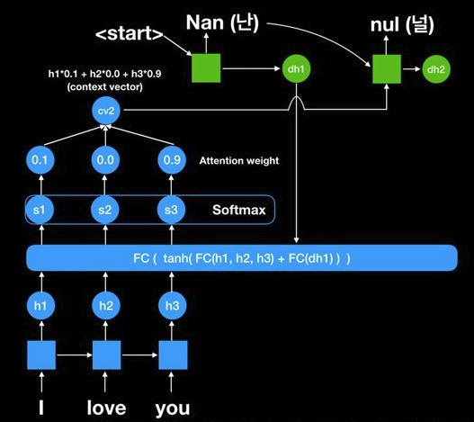
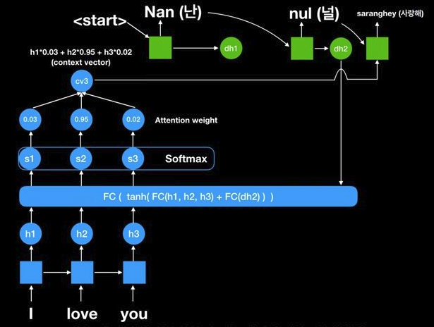
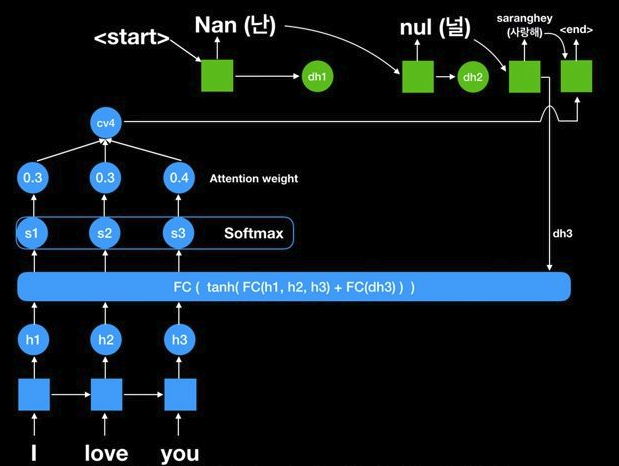
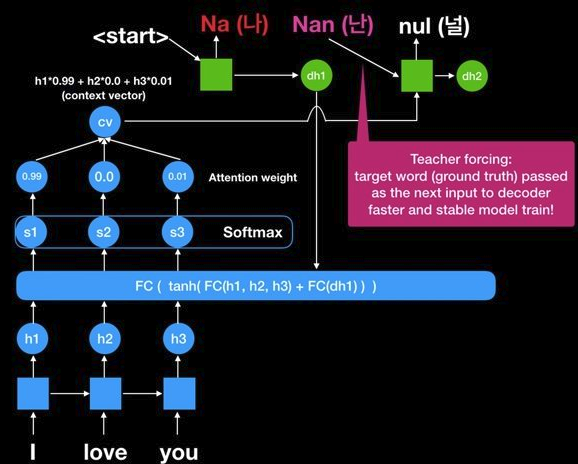

#### 영어를 한국어로 번역하는 데에 있어서의 일반적인 문제점
* 주어/동사/목적어 등의 문장을 구성하는 요수의 순서이 다르다.
* 영어와 한국어의 동일한 의미를 나타내는 문장을 구성하는 요소의 개수가 다를 수 있다. 

#### 기존의 sequence to sequence model

아래와 같이 encoder(RNN) - decoder(RNN) 구조로 되어 있다.

`context vector`를 시작으로 하여 `<start>`와 함께 입력으로 들어가 순차적으로 output을 도출하는 방식이다.

하지만, 위와 같은 구조에서는 다음과 같은 문제가 발생한다.

* `context vector`는 하나의 고정된 크기를 가진 vector이기 때문에 모든 정보를 함축할 수는 없다. 따라서, 입력 단어/문장의 길이가 길어지면 잘 되지 않을 수 있다.

따라서, 다음과 같이 모든 입력 정보를 활용하는 **Attention mechanism**을 통해서 이를 극복하자!

* 기존의 고정된 크기의 `context vector`를 통해 입력값을 함축하는 것이 아닌, 입력의 모든 정보를 토대로 하여 유동적으로 활용할 수 있는 구조를 제시한다.
* 이 때, 모든 정보를 그대로 활용하는 것이 아닌 중요한 정보를 차등적으로 더 집중할 수 있도록 한다.

더 자세히 이야기하자면, 아래와 같이 `I love you`라는 입력값에 대해서 `h3`가 기존의 방식에서는 `context vector`로서 활용이 되지만, 본 논문에서는 `h1, h2, h3`를 모두 활용하고자 한다.

1. 아래와 같이 encoder는 입력문장으로 부터 생성되는 `h1, h2, h3`를 모두 활용하여 tanh와 FC layer를 통과하도록 한다. 그리고 아직 decoder에서 생성된 단어가 없기 때문에 `h3`를 다시 더해주어 FC layer를 통과하도록 한다. 

통과한 값들은 score로서 각각의 `h1, h2, h3`에 대한 점수를 의미한다. 즉, 중요도를 나타내고 이를 softmax를 통해서 확률로서 변환을 하고, 이를 **attention wegihts**라고 명명한다. 

마지막으로, 계산한 각각의 중요도를 바탕으로 기존의 `h1, h2, h3`에 곱함으로서 decoder의 입력값을 도출하고, 첫 입력값이므로 `<start>`와 함께 decoder에 입력된다.

2. 두 번째 단어가 도출되는 과정은 아래와 같다.

1과 같은 과정을 거치며, 중요한 점은 ecoder의 state 값들이 항상 사용되고 있으며(어떤 값을 더 중요하게 다룰 것인가를 알려주기 때문에 그리고 그 attention weight는 1과는 다른다), 1과는 달리 decoder의 output인 `dh1`이 추가로 사용되었다는 점이다. 

이렇게 `context vector`의 값이 각각의 decoder output을 도출할 때마다 다르게 유동적(dynamic)으로 적용된다. 따라서, 기존보다 매우 효율적이다.

3. 세 번째 단어가 도출되는 과정은 아래와 같다.

4. `<end>`가 나올때까지 진행한다.

------------------------------------------------------------------------------

> 만약, prediction 값이 틀렸을 경우에는 어떻게 될까? 틀린값을 토대로 해서 계속적으로 decoder에서 output이 도출되면 좋지 않을 듯 하다!

예를 들어서, 아래와 같이 `Nan(난)`이 decoder에서 도출되어야 하지만, `Na(나)`가 도출되면 이를 통해서 다시 attention weight를 계산하기 때문에 매우 좋지 않다. 그러므로 학습시에는 정답을 넣어주는 teacher forcing이라는 개념을 활용하여 이를 해결한다.

### References
1. https://www.youtube.com/watch?v=WsQLdu2JMgI&ab_channel=MinsukHeo%ED%97%88%EB%AF%BC%EC%84%9D

2. [Neural_Machine_Translation_by_Jointly_Learning_to_Align_and_Translate](https://arxiv.org/pdf/1409.0473.pdf)