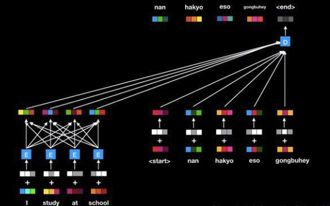
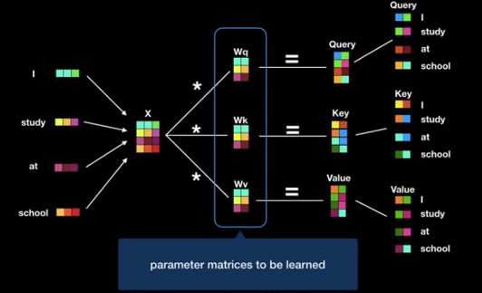
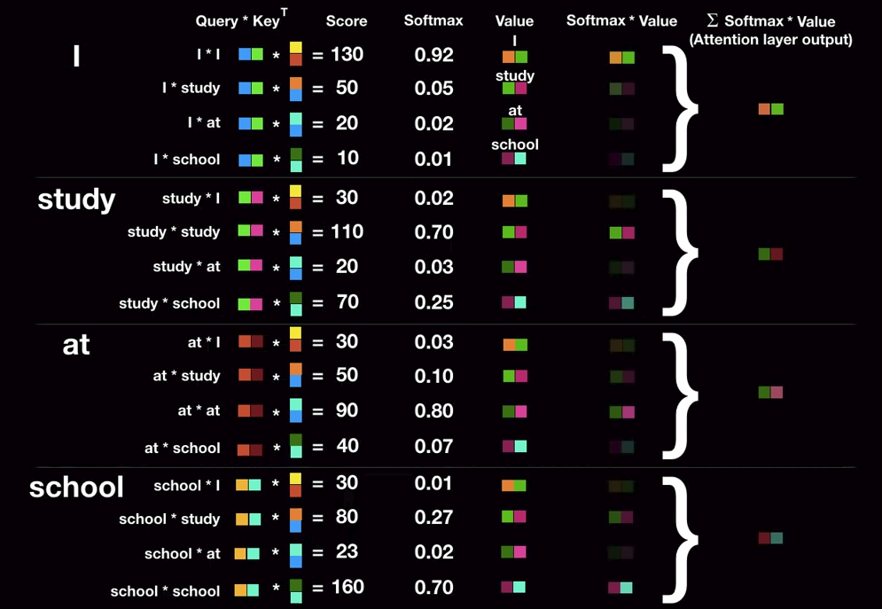

## Attention is all you need

기존의 seq2seq의 RNN으로 구성되는 Encder-Decoder를 발전시킨 알고리즘이다.

1. RNN을 사용하지 않았다. 따라서, 학습속도가 더 빠르다.

2. self-attention, positional encoding, multi-head attention, label smoothing, residual connection을 도입하였다. 

-----------------------------------------------------------------------------------
### Transformer

기존의 seq2seq model은 다음과 같다.

이는 ecoder로부터 생성되는 모든 값을 활용하고, 고정된 크기가 아닌 `dynamic context vector`로부터 decoder를 동작시킨다는 점에서 긴 문장에 대해서도 성능을 개선시킬 수 있었지만, 여전히 RNN을 사용함으로서 순차적으로 계산을 하기 때문에 느리다는 점과 attention에서도 성능을 개선시킬 수 있는 요소들이 존재했다.

**Transformer**는 이를 개선한 논문이다. 

1. Poisitional encoding
Transformer는 RNN을 대신하여 matrix computation을 수행하고 이는 모든 입력값을 한 번에 계산하기 때문에 속도가 더 빠르다.

그리고 RNN이 language model에서 주로 사용된 이유는 순차적인 계산이 가능했기 때문이다. 이는 언어로 이루어진 문장에서 순서가 중요했기 때문이고, 이 점을 고려하기 위해서 본 논문은 **positional encoding**을 소개한다.

이는 encoder와 decoder의 word embedding마다 <U>상대적인</U> 위치정보를 더해주는 방법이다.

위와 같은 경우를 들자면, `I`에는 `[0 0 1]`, `study`에는 `[0 1 0]`, `at`에는 `[0 1 1]`, `school`에는 `[1 0 0]`으로 하여 binary positional encoding으로 넣을 수 있다.

하지만, 본 논문에서는 sine과 cosine으로 넣어 모든 poisitional encoding값을 활용하였다. 이는 다음과 같은 장점을 갖는다.

* 모든 값이 -1과 1 사이에 오도록 제한을 둔다.

* 학습 데이터의 가장 긴 문장보다 더 긴 문장이 inference 중에 입력되어도 에러없이 positional encoding을 통해 상대적인 위치정보를 줄 수 있다.     

2. Self-attention

encoder에서 이루어지는 attention mechanism으로 크게는 **query, key, value**로 구성된다.

이 때, `Wq, Wk, Wv`는 학습에 의해서 업데이트되는 parameter인 weight matrix로 표현된다. 

3. Multi-head attention

4. Encoder layer with residual connection

5. Decoder layer

6. Label smoothing

## References
1. [Attention is all you need](https://arxiv.org/pdf/1706.03762.pdf)
2. https://www.youtube.com/watch?v=mxGCEWOxfe8&ab_channel=MinsukHeo%ED%97%88%EB%AF%BC%EC%84%9D