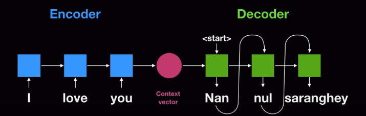

## Attention is all you need

기존의 seq2seq의 RNN으로 구성되는 Encder-Decoder를 발전시킨 알고리즘이다.
1. RNN을 사용하지 않았다. > faster train, but better performance by parallel calculation
2. self-attention, positional encoding, multi-head attention, label smoothing, residual connection을 도입하였다. 

---------------------------------------------------------------------------------------
### Transformer

기존의 seq2seq model은 다음과 같다.

## References
1. [Attention is all you need](https://arxiv.org/pdf/1706.03762.pdf)
2. https://www.youtube.com/watch?v=mxGCEWOxfe8&ab_channel=MinsukHeo%ED%97%88%EB%AF%BC%EC%84%9D