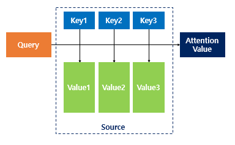
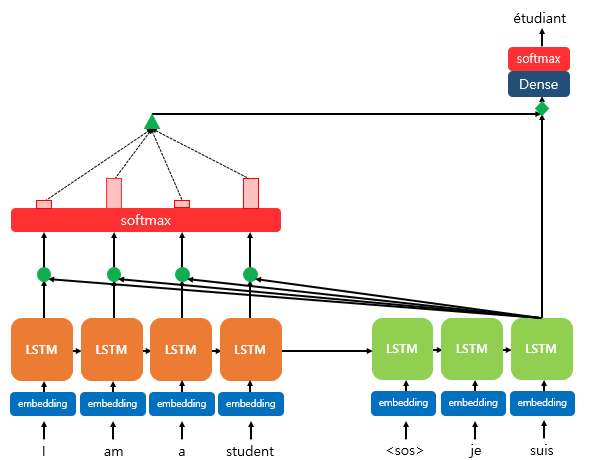
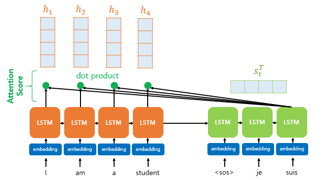
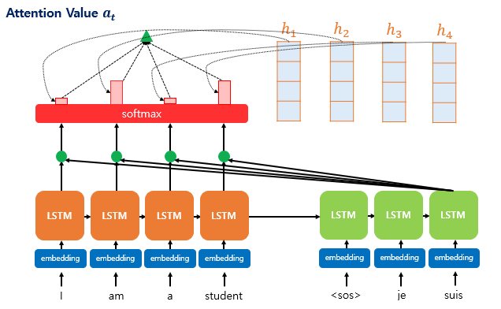
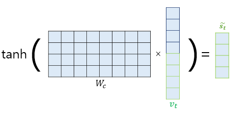
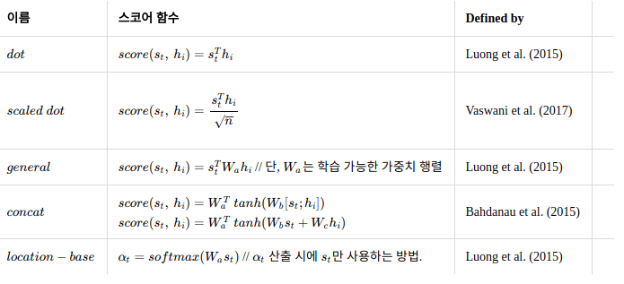

## Attention Mechanism

### Motivation

attention이 NLP에서 착안된 이유는 문장의 요소들에 중요도를 감안하여 활용하자는 점에 있다. 

### Attention function

attention을 계산하는 과정에서는 크게 `Query, Key, Value`로 구성되어 간략하게는 아래와 같이 나타낼 수 있다. 

$$ Attention Value = Attention(Q, K, V) $$

즉, attention은 주어진 `query`에 대해서 모든 `key`와의 유사도를 각각 구하고, 이 유사도를 `key`와 맵핑되어 있는 각각의 `value`에 반영해주는 것이다. 그리고 반영된 `value`들을 모두 더한값이 `Attention Value`이다.

> 이를 seq2seq 모델에 대해서 적용하면, 다음과 같이 정의한다.
* Query : t 시점의 디코더 셀에서의 은닉 상태
* Key : 모든 시점의 인코더 셀의 은닉 상태들
* Value : 모든 시점의 인코더 셀의 은닉 상태들

#### Dot-product attention

먼저, seq2seq 모델에서 attention mechanism이 RNN의 encoder-decoder의 구조에서 어떻게 활용되는지 다음과 같이 간략하게 설명하다.

위의 상황은 decoder의 세번째 LSTM 셀을 예측하고자 하는 것으로 encoder의 모든 입력 단어들의 정보를 다시 한번 참고한다. 그리고 softmax를 통해 나온 결과값은 `I, am, a, student` 단어 각각이 출력 단어를 예측할 때 얼마나 도움이 되는지의 정도를 수치화한 값이고 이를 활용함으로서 decoder의 예측 정확도가 개선된다.

* $h_t$: encoder의 $t-th$ cell hidden state

* $s_t$: decoder의 $t-th$ cell hidden state

> 이 때, dot-product를 하기 위해서는 ecoder와 decoder 각각의 hidden state는 동일한 차원을 가져아한다. (위의 그림에서는 동일하게 1x4차원이라고 할 수 있다.)

일반적으로 decoder에서 $t-th$ cell의 output을 예측하기 위해서는 $(t-1)th$의 hidden state와 $(t-1)th$ cell의 output이 필요하다. 그리고 attention mechanism이 적용하기 위해서 attention value라는 또 다른 값을 사용한다. (이를 $a_t$라고 명명한다.)

1. attention score

이는 decoder의 $t-th$ cell의 output($s_t$)을 예측하기 위해서 encoder의 모든 output이 얼마나 $s_t$와 유사한지를 나타내는 값이라고 할 수 있다. Dot-product attentionㅔ서는 이를 구하기 위해서 다음과 같이 계산한다.

$$ scoreTt = s_t^T * h_t = [s_t^Th_1, s_t^Th_2, ..., s_t^Th_N] $$ 

그리고 softmax를 통해서 모든 $score$의 합이 1이 되는 확률분포로서 표현을 할 수 있다. 이를 **attention distribution**이라고 한다. 그리고 각각의 값은 **attention weight**라고 정의한다. attention weight를 $\alpha$라고 명명하면, 다음과 같이 계산된다. 

$$ \alpha^t = softmax(score^t) $$

2. attention value

attention weight는 위와 같이 각각의 $h_i$와 곱하여 합으로서 attention value가 다음과 같이 도출된다. 

$$ a_t = \sum_{i=1}^N \alpha_i^t h_i $$

그리고 이는 encoder의 모든 정보를 포함하고 있다는 점에서 `conext vector`라고 표현할 수 있다. 

3. concatentation   

위와 같이 $a_t$를 $s_t$와 concatenattion하여 하나의 벡터로 만드는 작업을 수행하고, 이를 $v_t$라고 정의한다. 그리고 이 $v_t$를 $\hat{y}$ 예측 연산의 입력으로 사용하므로서 encoder로부터 얻은 정보를 활용하여 $\hat{y}$를 좀 더 잘 예측할 수 있게 된다.

4. 

그리고 $v_t$를 바로 출력층으로 보내기 전에 신경망 연산을 한 번 더 추가할 수 있다. 가중치 행렬과 곱한 후에 하이퍼볼릭탄젠트 함수를 지나도록 하여 출력층 연산을 위한 새로운 벡터인 $\tilde{s_t}$를 얻는다. 어텐션 메커니즘을 사용하지 않는 seq2seq에서는 출력층의 입력이 $t$시점의 은닉 상태인 $s_t$였던 반면, 어텐션 메커니즘에서는 출력층의 입력이 $\tilde{s_t}$가 되는 셈이다.

$$ \tilde{s_t} = tanh(Wc[\alpha_t;s_t]+b_c) $$

그리고 마지막으로 다음과 같이 output이 계산된다.

$$ \hat{y_t} = softmax(W_y \tilde{s_t} + b_y) $$

### 다양한 attention machanisms 

dot-product attention이외에도 여러가지의 attention mechaism이 존재하며, 중요한 차이는 다음과 같이 attention score를 구하는 함수라고 할 수 있다. 

위에서 $s_t$는 `Query`, $h_i$는 `Keys`, $W_a$와 $W_b$는 학습 가능한 가중치 행렬이다.

### References

1. https://arxiv.org/pdf/1409.0473.pdf
2. http://docs.likejazz.com/attention/
3. https://www.cs.cmu.edu/~bhiksha/courses/deeplearning/Fall.2015/slides/lec14.neubig.seq_to_seq.pdf
4. https://lilianweng.github.io/lil-log/2018/06/24/attention-attention.html
5. https://towardsdatascience.com/attn-illustrated-attention-5ec4ad276ee3