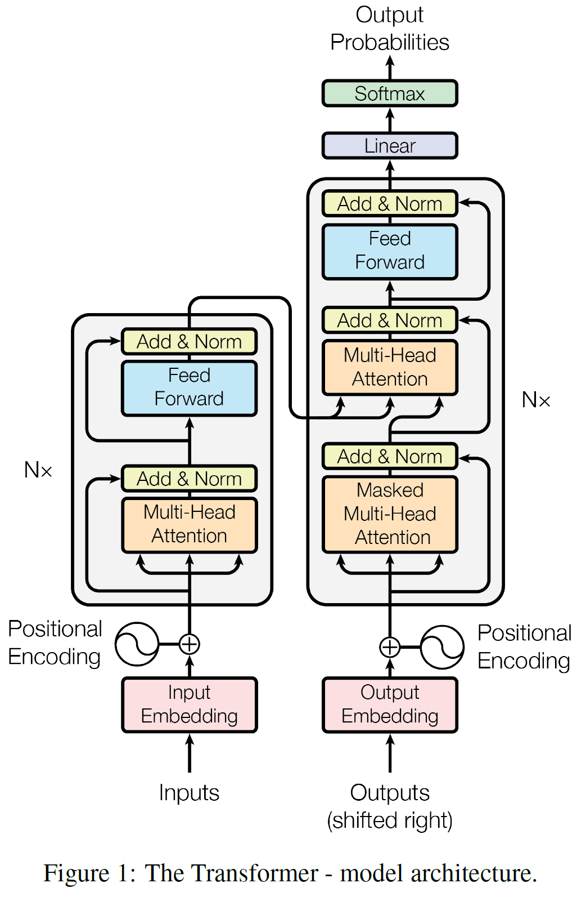

## Attention is all you need

### abs.
기존의 NLP에서는 필연적으로 RNN 또는 CNN을 기반으로 하는 encoder와 decoder를 활용해서 좋은 성능을 보여주었다. 또는 attention mechanism을 사용하여 encoder와 decoder를 연결했다. 

본 논문에서는 RNN 또는 CNN을 제외시키고 오직 attention mechanism을 활용한 **Transformer**라는 기법을 제안함으로써 기존에 존재하던 성능의 한계 또는 문제점을 해결하였다. 

### Model architecture

#### Encoder & Decoder

* encoder는 symbol representations ($x = x_1, ..., x_n$)의 입력을 continuous representations $(z = z_1, ..., z_n)$으로 매핑한다. 

* decoder는 z가 주어지면, 한번에 한 원소씩 출력 sequence ($y_1, ..., y_n$)을 생성한다. 

* 각 단계는 auto-regressive이며, 다음 단계의 symbol을 생성할 때 이전 단계에서 생성된 symbol을 추가 입력으로 받는다.

* Transformer는 encoder와 decoder 모두에서 쌓은 self-attention과 point-wise FC layer를 사용하며, 그 구성은 아래와 같다.

* N = 6개의 동일한 layer로 구성되며, 각각의 layer는 아래의 두 sub-layer로 구성되어 있다.
    * multi-head self-attention mechanism
    * simple, position-wise fully connected feed-forward network
    
각 sub-layer의 출력값은 $LayerNorm(x + sublayer(x))의 residual connection이고, 이를 위해서 embedding layer를 포함한 모델의 모든 sub-layer는 $d_{model} = 512$ 차원의 출력값을 가진다.

* N = 6개의 동일한 layer로 구성되어 있고, 각 layer는 세 개의 sub-layer로 구성된다. 
    * multi-head self-attention mechanism
    * simple, position-wise fully connected feed-forward network
    * encoder stack의 출력값에 multi-head attention을 수행하는 sub-layer
    
encoder와 비슷하게 residual connection이 각 sub-layer의 정규화 layer 뒤에 있다. 그리고 decoder가 출력을 생성할 때 다음 출력에서 정보를 얻는 것을 방지하기 위해 masking을 사용한다. 이는 $i$번째 원소를 생성할 때는 $1 ~ (i-1)$번째 원소만 참소할 수 있도록 하는 것이다.

